# QA Bug Report — Pulse CRM (https://qaassesment.twenty4x.net/)

**Tester:** KISHOR  
**Date:** July 8, 2026  
**Application:** Pulse CRM v1.4.2  
**Browsers Tested:** Chromium (Desktop & Mobile viewport), Microsoft Edge (Desktop)  
**Responsive Views Tested:** Desktop (1400px), Tablet (768px), Mobile (375px)

---

## Summary

| Severity | Count |
|----------|-------|
| 🔴 Critical | 2 |
| 🟠 High | 4 |
| 🟡 Medium | 5 |
| 🔵 Low | 4 |
| **Total** | **15** |

---

## Bug #1 — Customers Page Crashes on Load (React Runtime Error)

| Field | Details |
|-------|---------|
| **Severity** | 🔴 Critical |
| **Page** | `/customers` |
| **Browser/Device** | Chromium Desktop, Edge Desktop, Mobile (375px) — all browsers |

**Steps to Reproduce:**
1. Log in to the application
2. Click "Customers" in the sidebar navigation

**Expected:** The Customers page loads displaying a table of customer records.

**Actual:** The entire page crashes and shows a "This page didn't load" error screen. The browser console logs: `Error: A <Select.Item /> must have a value prop that is not an empty string` at `customers-fEWIgM3W.js:1:40863`. Clicking "Try again" reproduces the crash every time.

> [!CAUTION]
> This is a showstopper bug. The entire Customers section — a core feature of a CRM — is completely inaccessible. Users cannot view, add, edit, search, or delete any customers.

**Screenshot:**

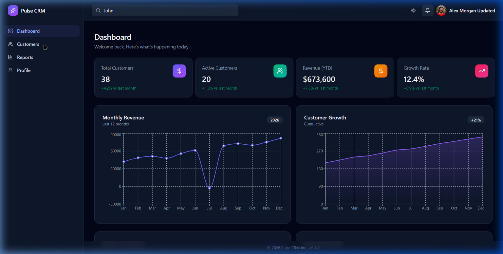

---

## Bug #2 — Login Accepts Any Password (No Password Validation)

| Field | Details |
|-------|---------|
| **Severity** | 🔴 Critical |
| **Page** | `/login` |
| **Browser/Device** | Chromium Desktop, Edge Desktop |

**Steps to Reproduce:**
1. Navigate to the login page
2. Enter email: `admin@pulse.com`
3. Enter any random password (e.g., `wrongpassword123`, `xyz`, etc.)
4. Click "Sign in"

**Expected:** Login should fail and display an "Invalid credentials" error message.

**Actual:** Login succeeds with any password as long as the email field contains a valid-format email. The user is redirected to the Dashboard with full access to the application. There is no actual authentication/password verification.

> [!CAUTION]
> This is a critical security vulnerability. Any user who knows or guesses a valid email address can gain full access to the CRM system without knowing the correct password.

**Screenshot:**

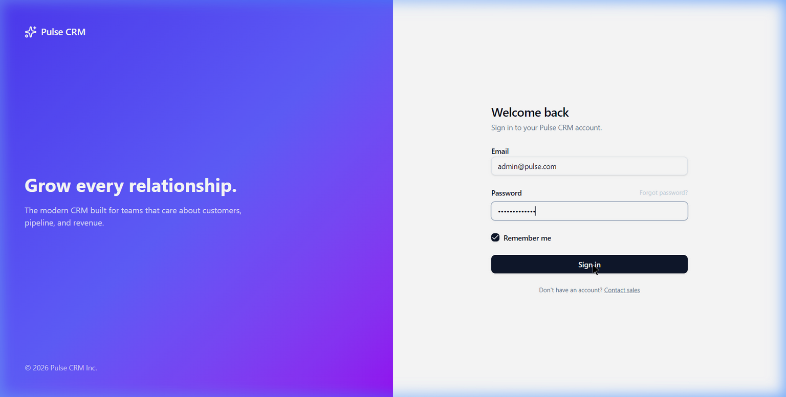

---

## Bug #3 — "Forgot Password?" Link is Non-Functional (Dead Link)

| Field | Details |
|-------|---------|
| **Severity** | 🟠 High |
| **Page** | `/login` |
| **Browser/Device** | Chromium Desktop, Edge Desktop |

**Steps to Reproduce:**
1. Navigate to the login page
2. Click the "Forgot password?" link next to the Password label

**Expected:** User should be redirected to a password reset/recovery page or a modal should appear.

**Actual:** The link has `href="#"` — clicking it does nothing except scrolling to the top of the page. No password recovery flow exists.

**Screenshot:**

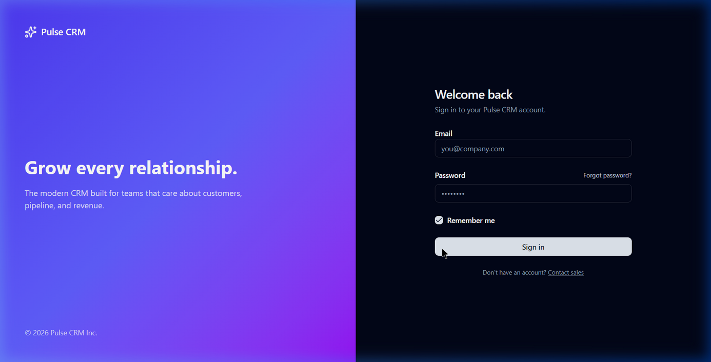

---

## Bug #4 — "Contact Sales" Link Redirects Back to Login Page

| Field | Details |
|-------|---------|
| **Severity** | 🟠 High |
| **Page** | `/login` |
| **Browser/Device** | Chromium Desktop, Edge Desktop |

**Steps to Reproduce:**
1. Navigate to the login page
2. Below the "Sign in" button, click the "Contact sales" link

**Expected:** User should be directed to a contact form, sales page, or mailto link.

**Actual:** The link points to `/login`, which simply reloads the same login page. The "Contact sales" link displays an "Email is invalid" validation error on the reloaded page (likely preserving empty form state).

**Screenshot:**

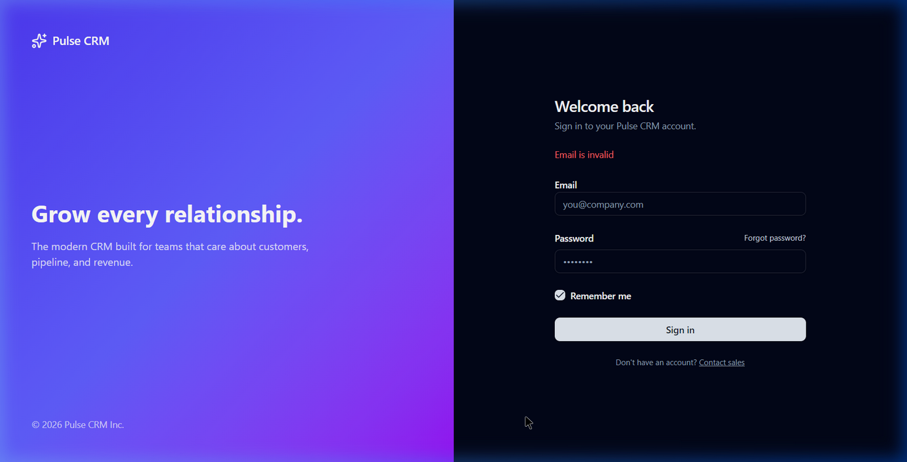

---

## Bug #5 — Profile Allows Saving Empty Name and Email (Missing Validation)

| Field | Details |
|-------|---------|
| **Severity** | 🟠 High |
| **Page** | `/profile` |
| **Browser/Device** | Chromium Desktop, Edge Desktop |

**Steps to Reproduce:**
1. Log in and navigate to the Profile page
2. Clear the "Full name" field (leave it empty)
3. Clear the "Email" field (leave it empty)
4. Click "Save changes"

**Expected:** Form validation should prevent saving with empty required fields and display error messages.

**Actual:** The form saves successfully with empty values. After saving:
- The user's name disappears from the top-right header (the name display element breaks)
- The profile is saved with blank name and email, corrupting the user data
- Changes persist after page refresh

**Screenshot:**

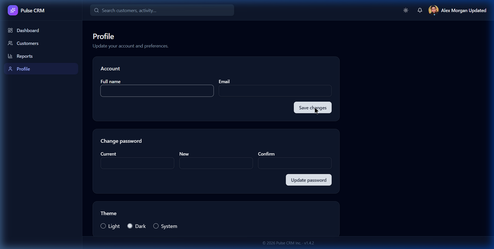

---

## Bug #6 — Global Search Bar is Non-Functional

| Field | Details |
|-------|---------|
| **Severity** | 🟠 High |
| **Page** | All pages (Header) |
| **Browser/Device** | Chromium Desktop, Edge Desktop |

**Steps to Reproduce:**
1. Log in to the application
2. Click the "Search customers, activity..." search bar in the top header
3. Type any search query (e.g., "John", "Benjamin", etc.)
4. Press Enter or wait for results

**Expected:** Search results should appear — either a dropdown with matching customers/activities, or navigation to a search results page.

**Actual:** Nothing happens. No search results appear, no dropdown opens, no navigation occurs. The search bar accepts input but is completely non-functional.

**Screenshot:**

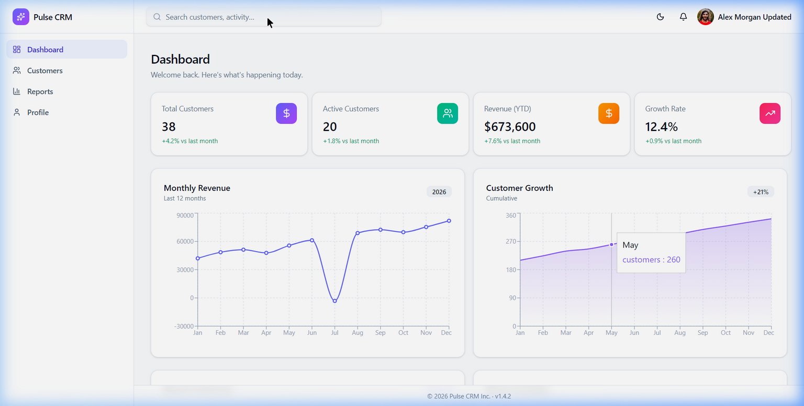

---

## Bug #7 — Revenue Data Mismatch Between Dashboard and Reports

| Field | Details |
|-------|---------|
| **Severity** | 🟡 Medium |
| **Page** | Dashboard (`/`) & Reports (`/reports`) |
| **Browser/Device** | Chromium Desktop |

**Steps to Reproduce:**
1. Log in and note the "Revenue (YTD)" card on the Dashboard: **$673,600**
2. Navigate to the Reports page
3. Sum all 12 monthly revenue values from the Revenue Report table

**Expected:** The YTD Revenue on the Dashboard should match the sum of monthly revenues from the Reports page.

**Actual:** 
- Dashboard shows: **$673,600**
- Reports sum (Jan–Dec): $42,000 + $48,500 + $51,200 + $47,800 + $55,600 + $61,200 + (−$3,200) + $68,900 + $72,400 + $69,800 + $76,300 + $81,900 = **$671,400** (accounting for July's negative)
- **Discrepancy: $2,200**

---

## Bug #8 — Negative Revenue Formatted Incorrectly ($-3,200 instead of -$3,200)

| Field | Details |
|-------|---------|
| **Severity** | 🟡 Medium |
| **Page** | `/reports` |
| **Browser/Device** | Chromium Desktop, Edge Desktop |

**Steps to Reproduce:**
1. Navigate to the Reports page
2. Scroll down to the July row in the Revenue Report table

**Expected:** Negative currency should be formatted as **-$3,200** (standard accounting format with the negative sign before the dollar sign).

**Actual:** July's revenue is displayed as **$-3,200** — the dollar sign appears before the negative sign, which is a non-standard and confusing currency format.

**Screenshot:**

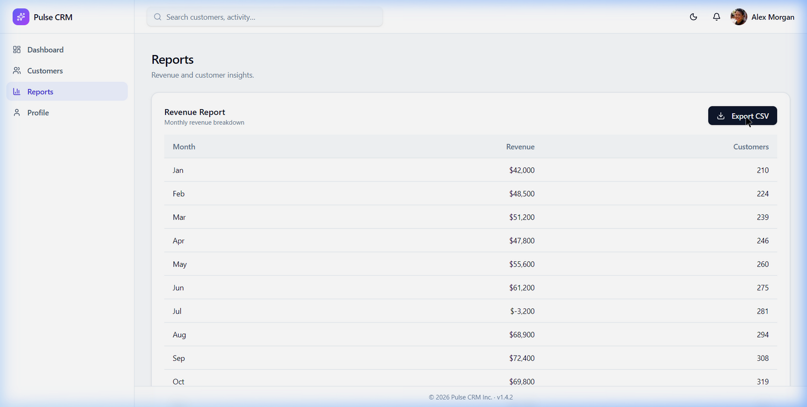

---

## Bug #9 — Dashboard "Total Customers" Card Uses Wrong Icon (Dollar Sign Instead of People Icon)

| Field | Details |
|-------|---------|
| **Severity** | 🟡 Medium |
| **Page** | Dashboard (`/`) |
| **Browser/Device** | Chromium Desktop, Edge Desktop |

**Steps to Reproduce:**
1. Log in and view the Dashboard
2. Look at the "Total Customers" summary card (first card)

**Expected:** The "Total Customers" card should display a people/users icon to represent customers.

**Actual:** The card displays a **dollar sign ($) icon** in a purple circle, which is typically associated with revenue/financial data, not customer count. This is misleading and inconsistent — the "Revenue (YTD)" card already uses a dollar sign icon (in orange).

**Screenshot:**

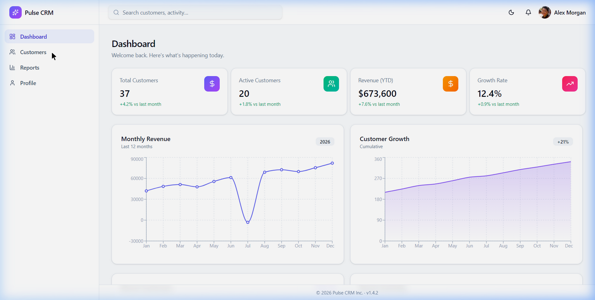

---

## Bug #10 — Customer Count Discrepancy (Dashboard 38 vs. Customer Growth Chart ~350)

| Field | Details |
|-------|---------|
| **Severity** | 🟡 Medium |
| **Page** | Dashboard (`/`) |
| **Browser/Device** | Chromium Desktop, Edge Desktop |

**Steps to Reproduce:**
1. Log in and view the Dashboard
2. Note "Total Customers" card shows **38**
3. Hover over the "Customer Growth" chart — it shows cumulative customers reaching **342** by December

**Expected:** The "Total Customers" summary card and the "Customer Growth" chart should reference the same customer dataset.

**Actual:** The Total Customers card shows **38** while the Customer Growth chart shows cumulative customer counts ranging from ~210 to ~342. These numbers are wildly inconsistent and cannot both be correct. The Reports page also shows customer counts up to 342.

---

## Bug #11 — Inconsistent Date Formats in "Recent Activities"

| Field | Details |
|-------|---------|
| **Severity** | 🟡 Medium |
| **Page** | Dashboard (`/`) |
| **Browser/Device** | Chromium Desktop, Edge Desktop |

**Steps to Reproduce:**
1. Log in and scroll down to the "Recent Activities" section on the Dashboard
2. Compare the date formats across different activity entries

**Expected:** All dates should use a consistent format (e.g., all ISO 8601 or all human-readable).

**Actual:** Mixed date formats are used:
- Most entries use ISO 8601: `2025-08-02T15:45:00Z`, `2025-07-28T09:00:00Z`
- One entry ("Renewal discussion") uses a different format: `07/12/2025`

This inconsistency confuses users and looks unprofessional.

**Screenshot:**

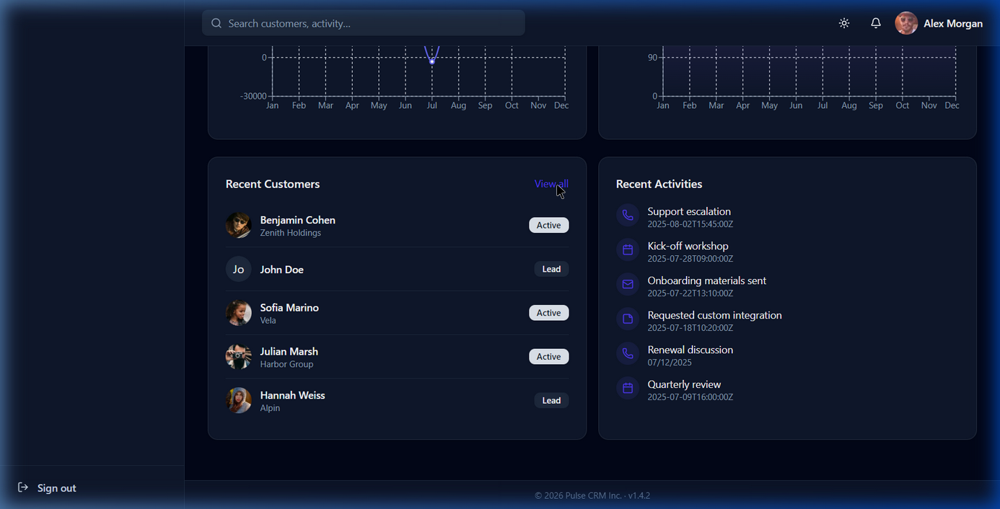

---

## Bug #12 — Notification Bell Icon is Non-Functional

| Field | Details |
|-------|---------|
| **Severity** | 🔵 Low |
| **Page** | All pages (Header) |
| **Browser/Device** | Chromium Desktop, Edge Desktop |

**Steps to Reproduce:**
1. Log in to the application
2. Click the bell (🔔) notification icon in the top-right header

**Expected:** A notifications dropdown/panel should appear showing recent notifications, or a notifications page should open.

**Actual:** Nothing happens. No dropdown appears, no page navigation occurs. The bell icon has no click handler or functionality.

**Screenshot:**

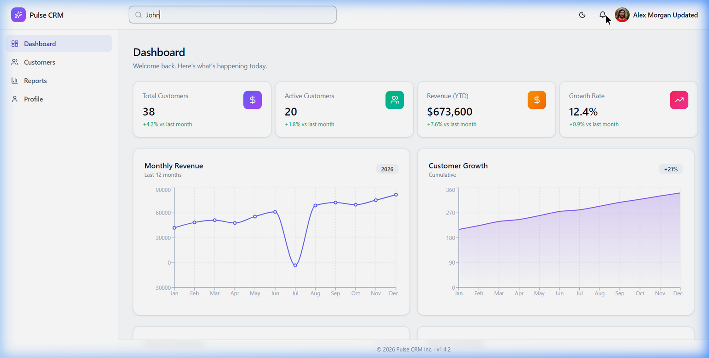

---

## Bug #13 — Data Quality Issues: Typos and Inconsistent Casing in Customer Records

| Field | Details |
|-------|---------|
| **Severity** | 🔵 Low |
| **Page** | `/reports` (Customer Report table) and `/customers` (if accessible via Add Customer) |
| **Browser/Device** | Chromium Desktop |

**Steps to Reproduce:**
1. Navigate to the Reports page
2. Scroll down to the Customer Report table
3. Examine the data rows carefully

**Expected:** All data should be clean, consistent, and free of typos.

**Actual:** Multiple data quality issues found:
- **Typo:** Country misspelled as **"Untied States"** instead of "United States"
- **Casing Inconsistency:** One customer status is **lowercase "active"** while all others are properly capitalized (e.g., "Active", "Lead", "Inactive")
- **Missing Data:** Some customer records have empty Company and Country fields without any placeholder

---

## Bug #14 — "John Doe" Avatar Displays Wrong Initials ("Jo" Instead of "JD")

| Field | Details |
|-------|---------|
| **Severity** | 🔵 Low |
| **Page** | Dashboard (`/`) — Recent Customers section |
| **Browser/Device** | Chromium Desktop, Edge Desktop |

**Steps to Reproduce:**
1. Log in and scroll down to the "Recent Customers" section on the Dashboard
2. Find the "John Doe" entry (which has a placeholder avatar circle, not a photo)

**Expected:** The placeholder avatar should display the initials **"JD"** (first letter of first name + first letter of last name).

**Actual:** The avatar displays **"Jo"** instead of "JD", which appears to be the first two characters of the first name rather than proper initials.

**Screenshot:**

---

## Bug #15 — Mobile: Profile Page "Save Changes" Button Floats/Overlaps When Scrolling

| Field | Details |
|-------|---------|
| **Severity** | 🔵 Low |
| **Page** | `/profile` (Mobile view, 375px width) |
| **Browser/Device** | Chromium Mobile viewport (375px) |

**Steps to Reproduce:**
1. Open the site on a mobile viewport (375px width)
2. Log in and navigate to the Profile page
3. Scroll down to the "Change password" section

**Expected:** The "Save changes" button from the Account section should scroll away with its parent card.

**Actual:** The "Save changes" button remains visually stuck in a collapsed dark container at the top of the viewport, overlapping the "Change password" form fields below.

**Screenshot:**

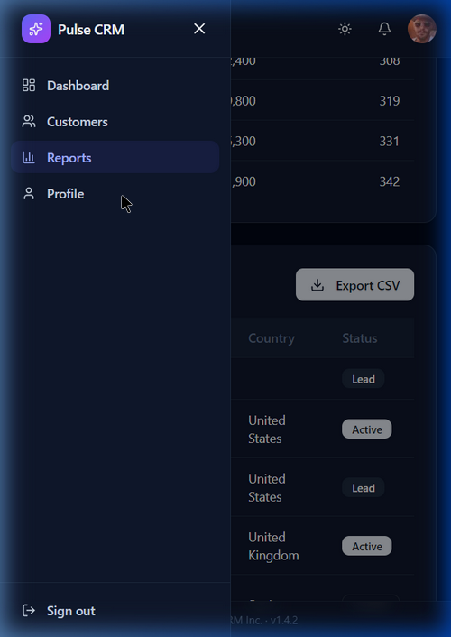

---

## Testing Environment

| Property | Details |
|----------|---------|
| **OS** | Windows |
| **Browser 1** | Chromium (Desktop, 1400px viewport) |
| **Browser 2** | Microsoft Edge (Desktop, 1400px viewport) |
| **Mobile Testing** | Chromium with viewport resized to 375px (iPhone simulation) |
| **Tablet Testing** | Chromium with viewport resized to 768px |
| **Application Version** | Pulse CRM v1.4.2 |
| **Test URL** | https://qaassesment.twenty4x.net/ |
| **Test Date** | July 8, 2026 |

---

## Items That Passed

| Feature | Result |
|---------|--------|
| Login page password masking | ✅ Pass |
| Form submission via Enter key | ✅ Pass |
| Dark/Light theme toggle | ✅ Pass |
| 404 page with "Go home" navigation | ✅ Pass |
| Keyboard (Tab) navigation with focus rings | ✅ Pass |
| Mobile sidebar collapses to hamburger menu | ✅ Pass |
| Dashboard cards stack properly on mobile | ✅ Pass |
| Profile changes persist after refresh | ✅ Pass |
| Reports page includes all 12 months (Jan–Dec) | ✅ Pass |
| Export CSV button triggers download | ✅ Pass |
| Login page responsive layout (mobile) | ✅ Pass |
